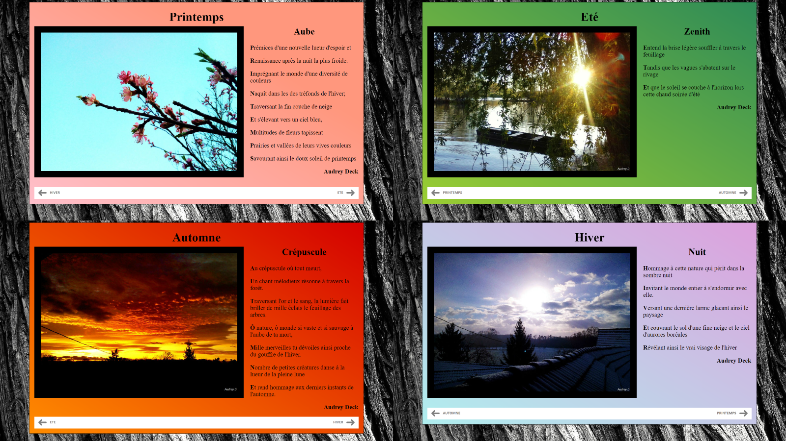
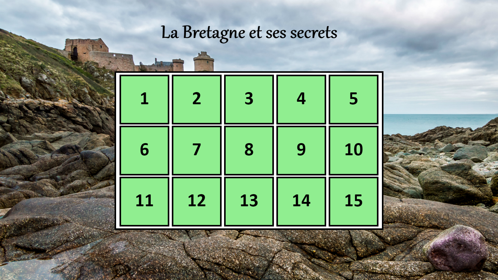
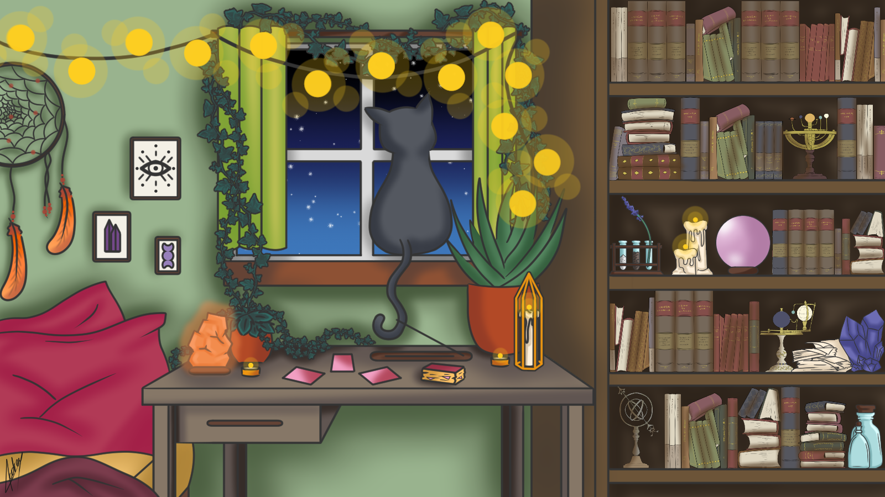

<h2> Portfolio <h2>

---
---

<h3> Projets web <h3>

---

<h4><a href="/infos_saisons.md"> Au fil des saisons </a></h4>

<h4><a href="/infos_paris.md"> A la découverte de Paris </a></h4>

<h4><a href="/infos_bretagne.md"> La Bretagne et ses secrets </a></h4>

---
---

<h3> Projets tablette graphique Wacom Intuos <h3>

---

<h4><a href="/premiers_pas.md"> Premiers pas </a></h4>

<h4><a href="/fonddecran.md"> Fonds d'écran </a></h4>

---

Page template forked from <a href="https://github.com/evanca/quick-portfolio">evanca</a>

<!-- Remove above link if you don't want to attibute -->
