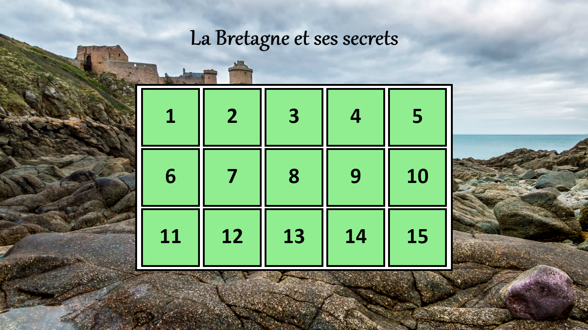
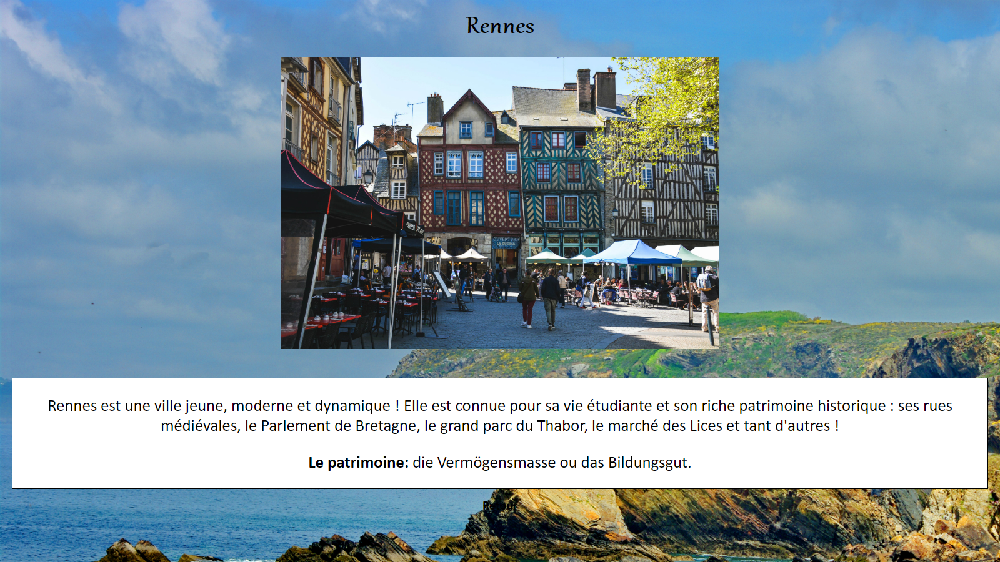
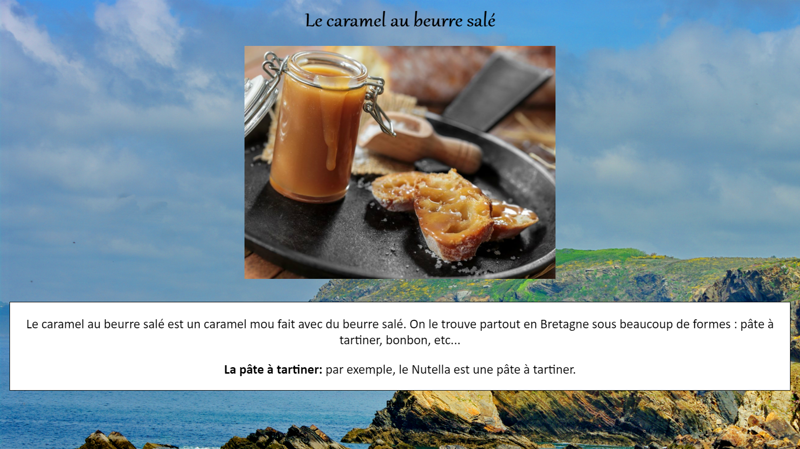

## La Bretagne et ses secrets

**Description du projet :**
 
Un jeu de l'oie pour découvrir la Bretagne ! Créé dans le cadre de mon emploi en tant qu'assistante de langue étrangère dans une école allemande en Bavière, DE.
 

### 1. Le visuel
#### 1.1. La page d'accueil

Elle représente le plateau de jeu. Par groupes de 4 à 5 personnes, les élèves se voient attribuer des dés ainsi qu'un exemplier à remplir. Le but du jeu : lancer les dés, découvrir un lieu et répondre aux questions !
  
Les images utilisées sont libres de droit.
 

#### 1.2. Les lieux

Chaque endroit est représenté par une image et par un texte explicatif. Le défi a été le même que pour la carte interactive de Paris : créer une activité ludique et éducative 
accessible à tous les élèves. 

### 2. L'activité

Chaque élève a eu un exemplier détaillant l'activité qu'ils devaient remplir au fur et à mesure. Le premier exercice leur demande de répondre à des questions, les informations se trouvant dans le jeu. Le deuxième, pour celles et ceux ayant fini plus tôt, est un mot mêlés reprenant le vocabulaire fraîchement appris !
 
-> [Exemplier](/pdf/handout_bretagne.pdf)

### 3. Work in progress

Plusieurs améliorations sont encore à apporter. Mes connaissances à l'époque ne me permettaient pas de finaliser ce projet même s'il fonctionne correctement tel qu'il est. Parmi les ajouts : une fonction qui permet de lancer des dés, mettre en place des pions qui se déplacent et griser les cases déjà visitées.

<a href="audreydeck.github.io">Retour</a>

