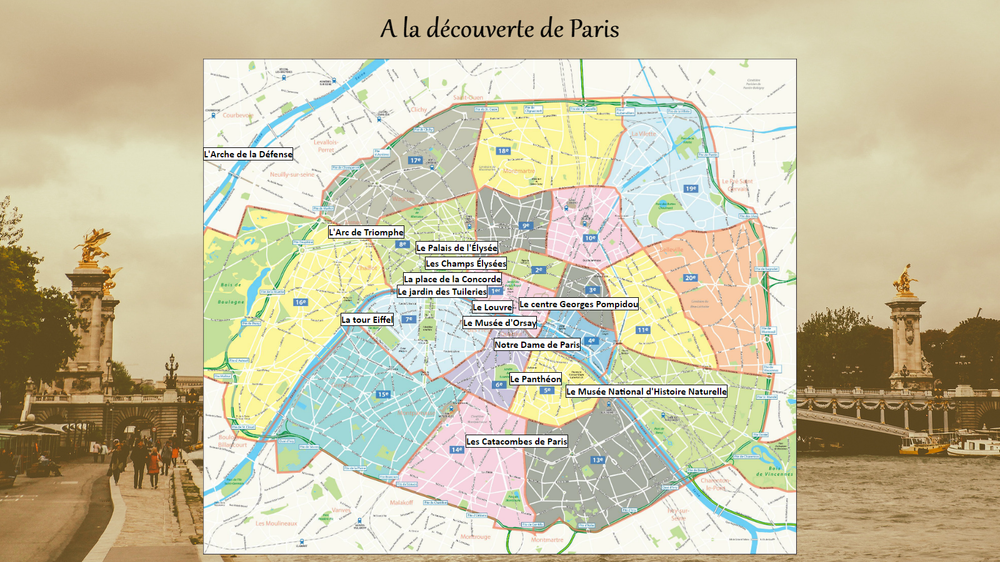
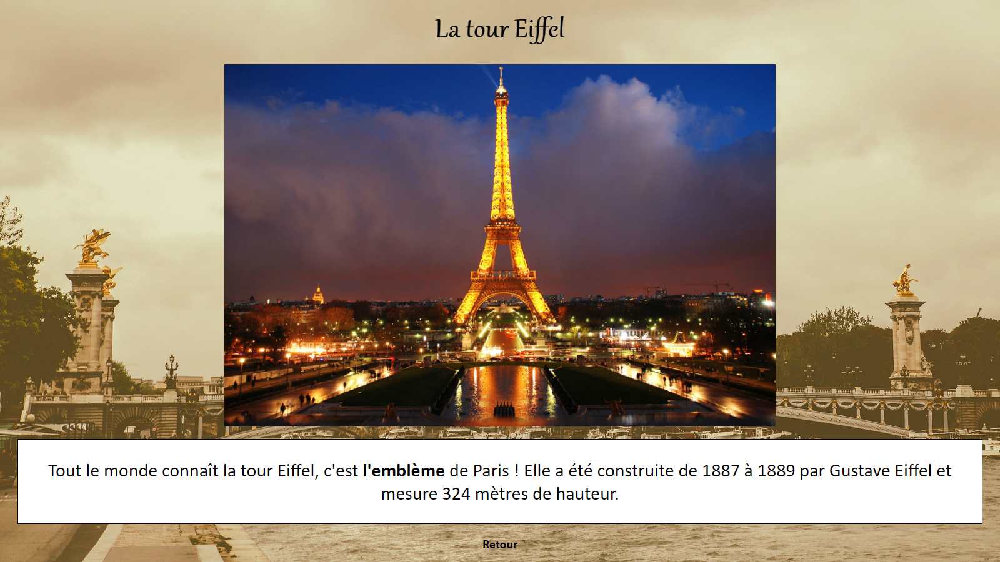
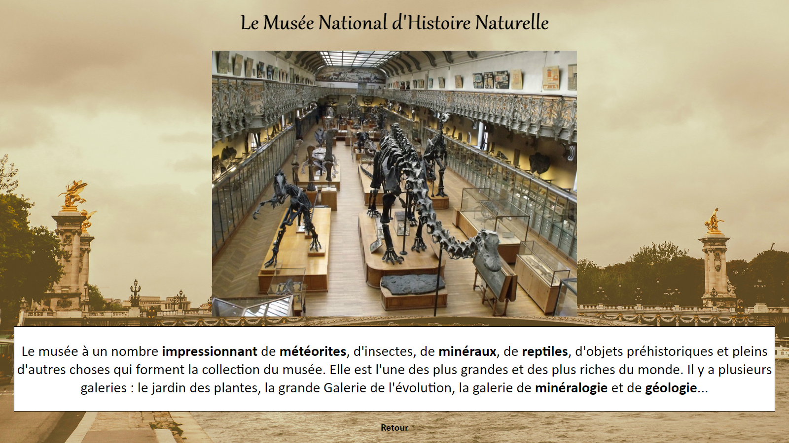

## A la découverte de Paris

**Description du projet :**
 
Une visite guidée de Paris ! Créer dans le cadre de mon emploi en tant qu'assistante de langue étrangère dans une école allemande en Bavière, DE.
 

### 1. Le visuel
#### 1.1. La page d'accueil

Elle représente une carte de Paris avec les monuments les plus emblématiques de la capitale. Ainsi les élèves ont pu avoir un apperçu de la ville comme s'ils y étaient ! En 
cliquant sur les différents lieux, une nouvelle page s'ouvre sur image ainsi qu'un texte explicatif.
  
Les images utilisées sont libre de droit.
 

#### 1.2. Les lieux

Chaque endroit est représenté par une image et un texte explicatif. Ayant différentes classes dont le niveau de français varies en fonction des élèves, le défi a été de créer une activité ludique et éducative accessible à tous. Les élèves ont pu venir au tableau, selectionner le monument qui les interessent et lire la description. Les mots complexes ont été mis en gras et chaque élève avait à sa disposition un exemplié avec les définitions, qui ont été expliqué à voix haute pour s'assurer que tous le monde à compris.

### 2. L'activité

Les activités autour de Paris furent construite comme une visite guidée. A vous de (re)découvrire la capitale !
  
Chaque élève a eu un exemplier à remplir au fur et à mesure. L'activité commence par quelques question sur Paris : qui a déjà visité la ville, quels endroit aimeraient-ils ou ont-ils visités ? Le premier exercice leur demande de répondre à des questions, les informations se trouvant sur la carte. Le deuxième exercice est une activité de groupe : chaque groupe reçoit une feuille illustrant les différents lieux visités, à eu de retrouver leurs noms ! Et pour finir, un mots mélés qui repprant le vocabulaire fraîchement appris.
 
-> [Exemplier](/pdf/handout_paris.pdf)
  
Une deuxième activité que j'ai eu l'occasion de faire fût une visite guidée de notre magnifique capitale. Basée sur la carte et sur leur connaissance, les élèves ont pu redécouvrir les monuments à travers différents jeux de plateau !
 
->[Visite guidée](/pdf/station_paris.pdf)

<a href="audreydeck.github.io">Retour</a>

