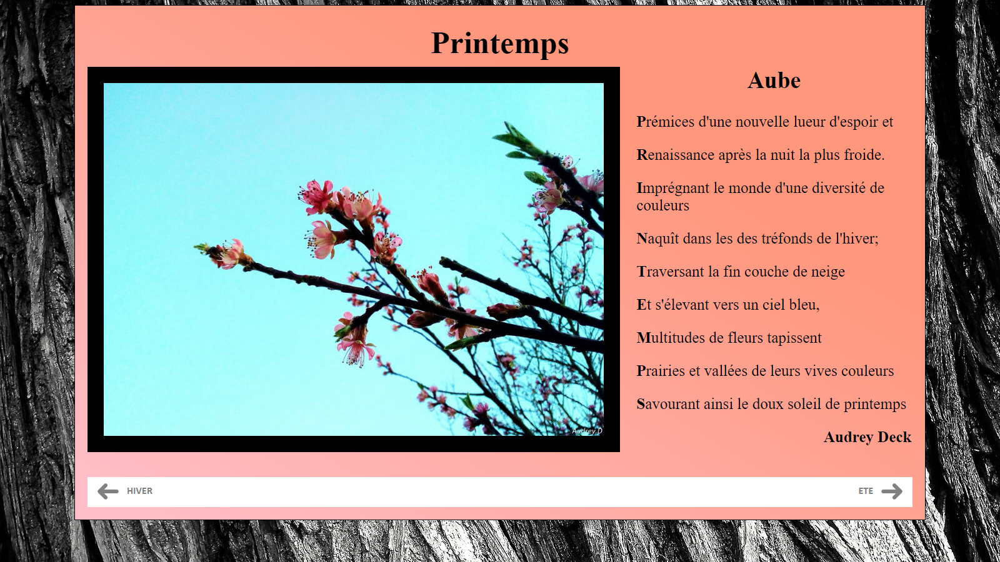
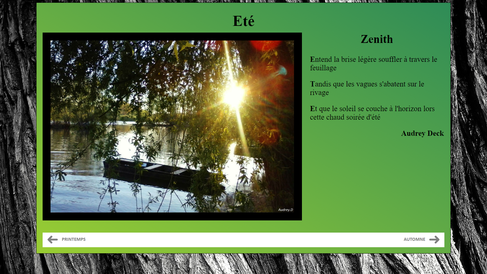
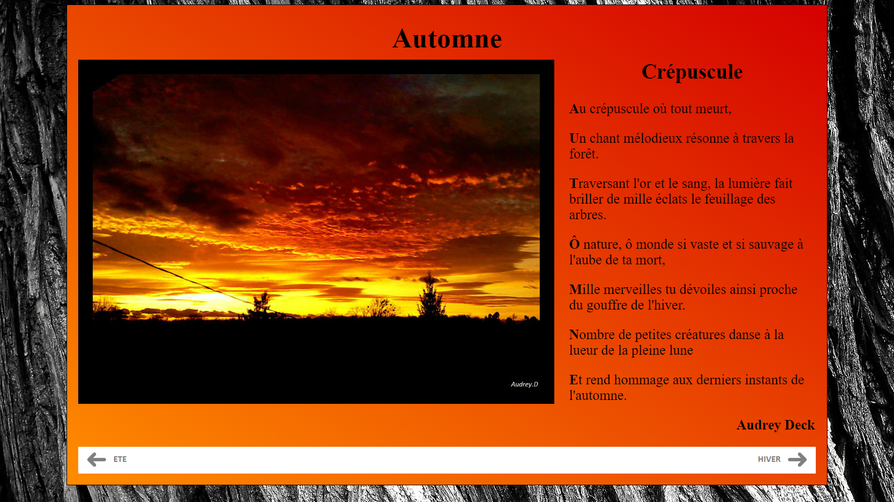
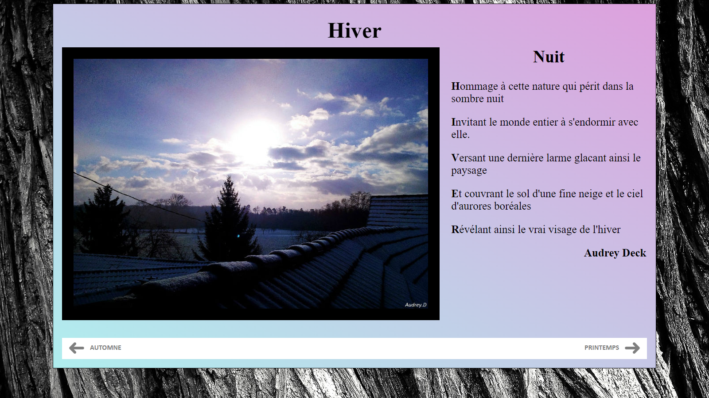

## Premiers pas en HTML et CSS

**Project description:**
<br>
HTML et CSS ont été les premiers langages de programmation avec lesquels j'ai travaillé. Ci-dessous, les premières pages web que j'ai eu l'occasion de coder.
<br>

### 1. Le visuel

Nous avons 4 pages web, une pour chaque saison de l'année. Chaque page est composée d'une image et d'un poème sur un fond dégradé en lien avec la saison. En bas de la page, se situe deux liens pour aller soit à la saison précédente, soit à la saison suivante.
<br>
L'image utilisé pour le fond est libre de droit.
Les images utilisés pour chaque saisons ainsi que les poèmes sont de moi.
<br>






### 2. Le code

Pour cette première approche, j'ai coder l'ensemble des pages manuellement afin de mieux intégrer les différentes balises mais aussi les bases en HTML et CSS. 

```javascript
<html>
	<head>
		<title>Printemps</title>
		<meta charset="UTF-8"/>
		<link href="saisons.css" rel="stylesheet" type="text/css"/>
	</head>
	<body class="printemps">
		<div class="content">
			<h1>Printemps</h1>
			
			<div class="img">
				
			</div>
			
			<div class="poème">
				<h2>Aube</h2>
				<p><strong>P</strong>rémices d'une nouvelle lueur d'espoir et</p>
				<p><strong>R</strong>enaissance après la nuit la plus froide.</p>
				<p><strong>I</strong>mprégnant le monde d'une diversité de couleurs</p>
				<p><strong>N</strong>aquît dans les des tréfonds de l'hiver;</p>
				<p><strong>T</strong>raversant la fin couche de neige</p>
				<p><strong>E</strong>t s'élevant vers un ciel bleu,</p>
				<p><strong>M</strong>ultitudes de fleurs tapissent</p>
				<p><strong>P</strong>rairies et vallées de leurs vives couleurs</p>
				<p><strong>S</strong>avourant ainsi le doux soleil de printemps</p>
				<p class="auteur">Audrey Deck</p>
			</div>
			
			<table>
				<tr>
					<td><a href="hiver.html">HIVER</a></td>
					<td><a href="ete.html">ETE</a></td>
				<tr>
			</table>
		</div>
	</body>
</html>
```
