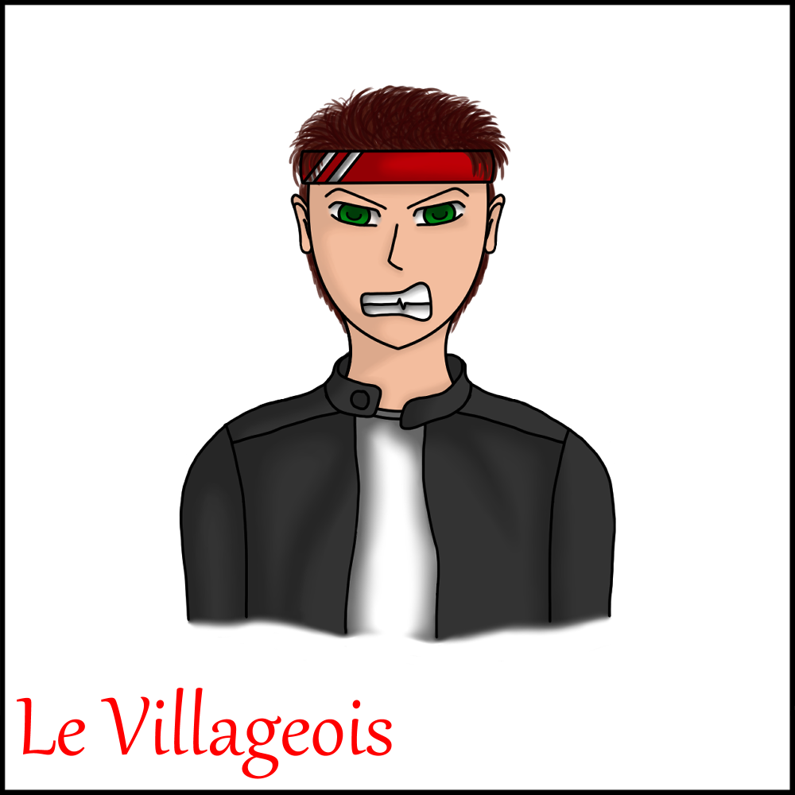
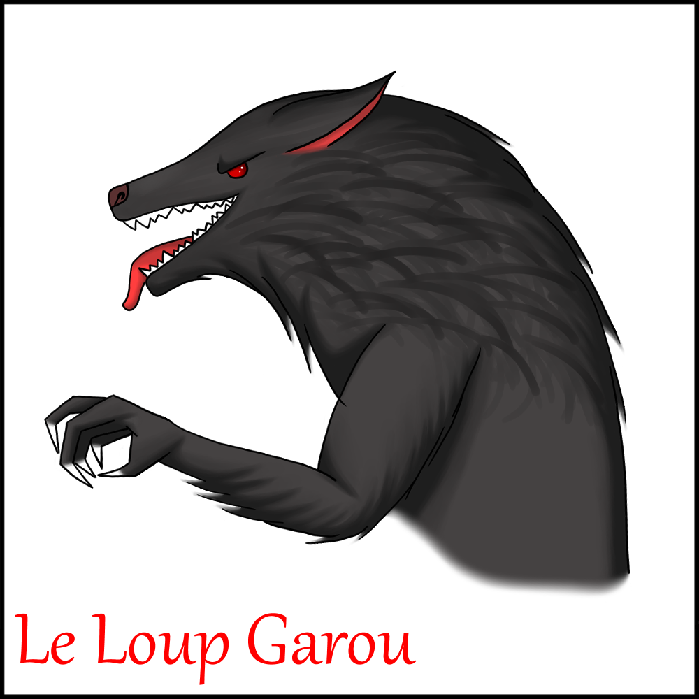
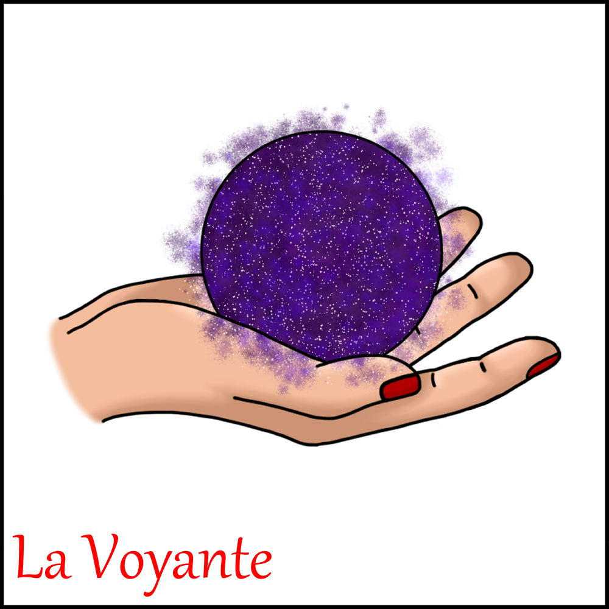
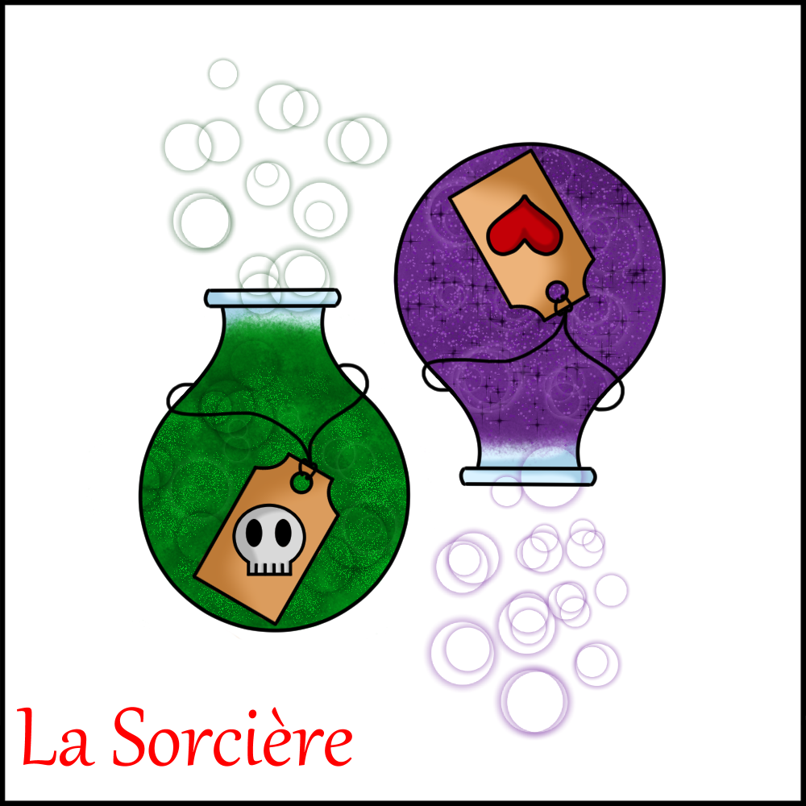
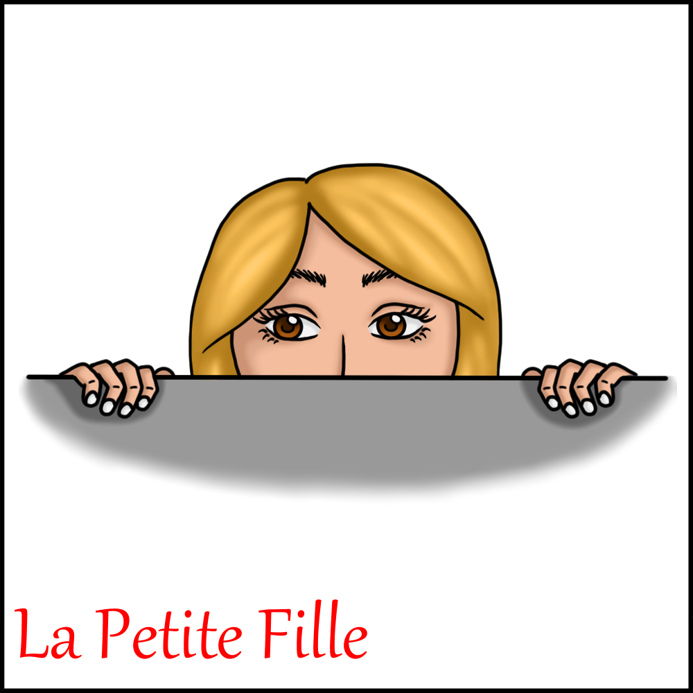
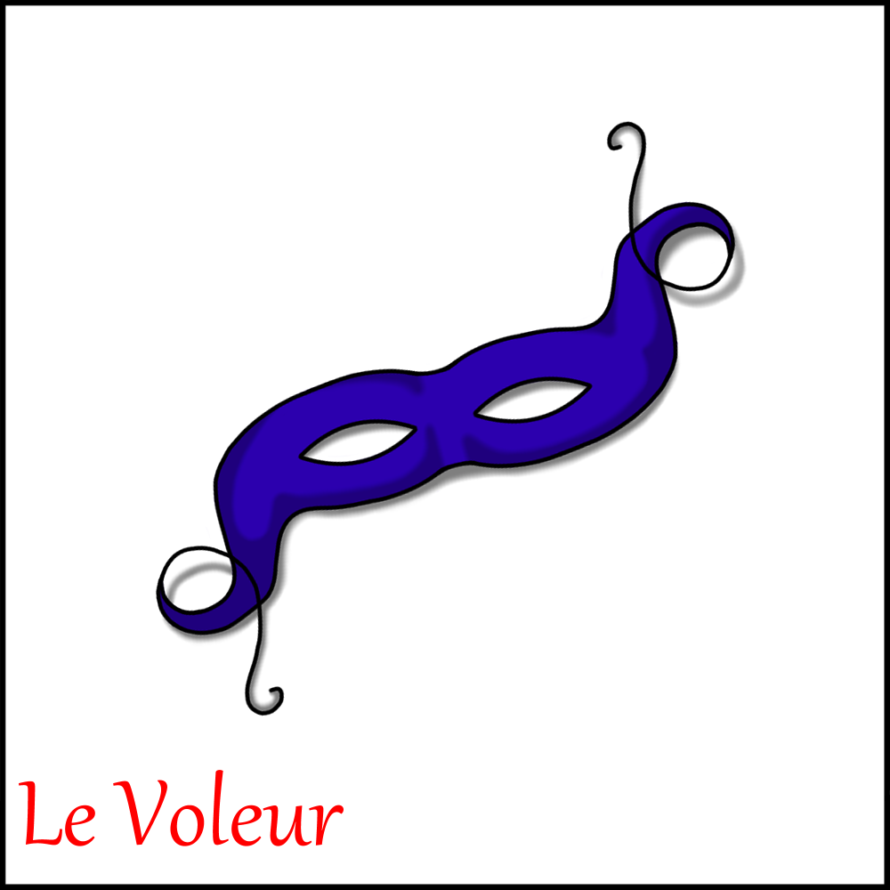
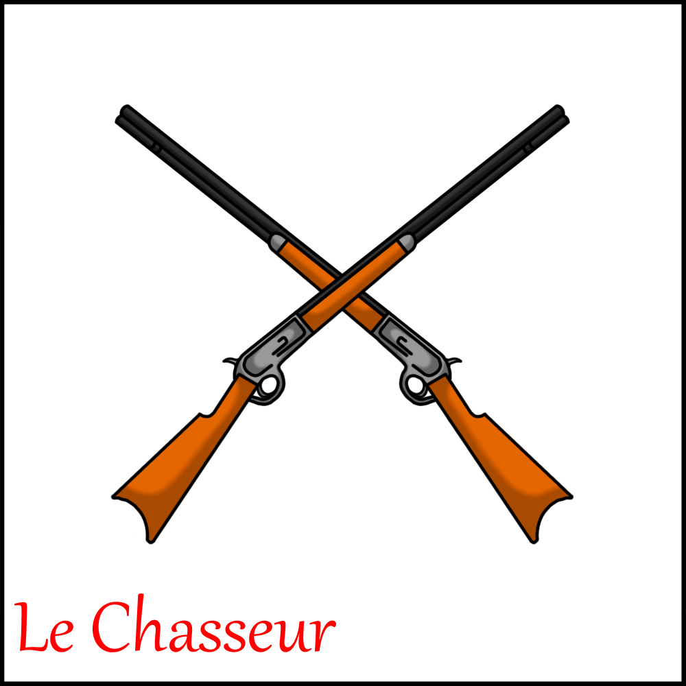
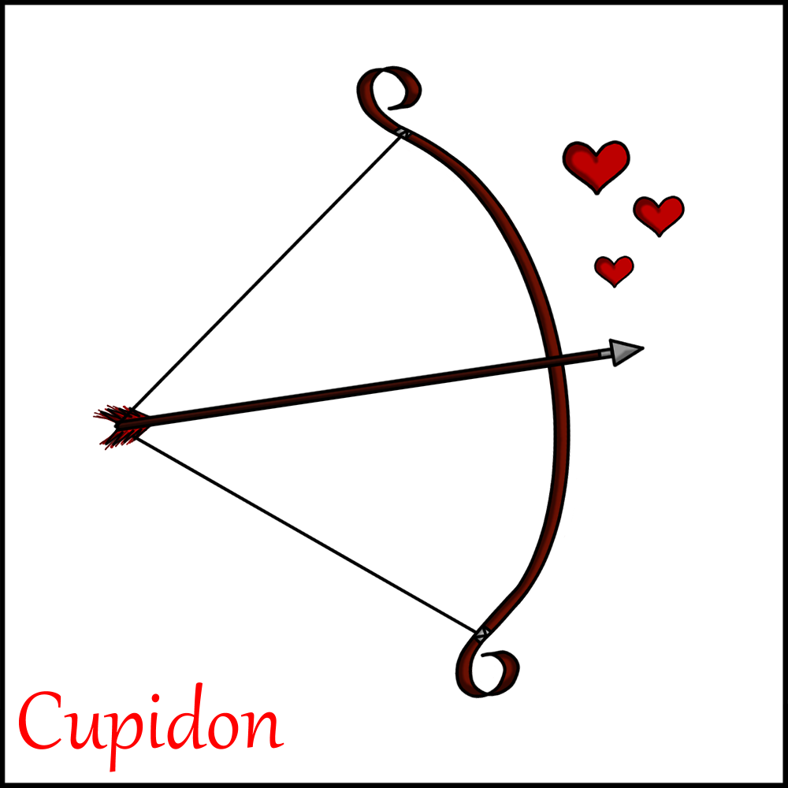
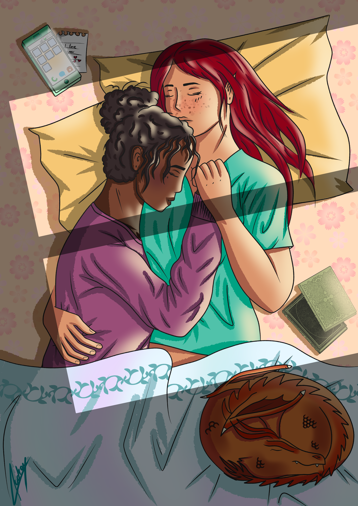

## A vos crayons !

### 1. Où tout a commencé...

Je dessine depuis que j'ai appris à tenir un crayon ce qui remonte à une bonne vingtaine d'année. Même si mes créations n'étaient pas du niveau des plus grands artistes, j'ai 
continué de m'exercer année après année, perfectionnant mes techniques et apprenant des nouvelles.
Les nouvelles technologies n'ayant pas encore envahi nos vies lorsque j'étais jeune, le crayon et la feuille ont été mes premiers outils avant d'être remplacés par un stylet et 
une tablette graphique.

### 2. Evolution

Avant d'avoir pu m'acheter une tablette graphique, j'ai scanné mes dessins puis je les ai mis en couleur avec Gimp...

  Pour voir chaque image individuellement, cliquez sur les liens ci-dessous. 
  <a href="/images/graphique/sirène_bleu.png">Portrait 1</a> - <a href="/images/graphique/enora.png">Portrait 2</a> - <a href="/images/graphique/personnage.png">Portrait 3</a>
 
  <i>Dessins réalisés en 2017</i>

... puis, lorsque l'occasion s'est présentée, je me suis achetée une tablette graphique Wacom Intuos et depuis j'utilise le logiciel Clip Studio Paint pour mettre en couleur 
mes dessins ...
  
Mon premier projet a été de redessiner le jeu du Loup-Garou afin de me familiariser avec mon nouvel environnement de travail.

<table>
  <tr>
    <td></td>
    <td style="text-align:center">Seras-tu un innocent villageois ...</td>
  </tr>
  <tr>
    <td style="text-align:center">... Un terrible loup-garou ...</td>
    <td></td>
  </tr>
  <tr>
    <td style="text-align:center" colspan="2">... Ou bien seras-tu la personne qui changera le cours de la partie ?</td>
  </tr>
  <tr>
    <td></td>
    <td></td>
  </tr>
  <tr>
    <td></td>
    <td></td>
  </tr>
  <tr>
    <td></td>
    <td></td>
  </tr>
</table>

### 3. Progression

Les proportions étant un peu ma bête noire niveau dessin, j'ai tout d'abord commencer par dessiner les personnages de face en m'aidant de repères pour que tout soit à la bonne taille. Plus je gagnais confiance en ce que je produisais, plus je me lancais dans de nouveaux défis : dessiner de profil/de trois-quart, faire des personnages entiers en movement, etc.

#### 3.1. Portraits

  Pour voir chaque image individuellement, cliquez sur les liens ci-dessous. 
  <a href="/images/graphique/portrait_1.png">Portrait 1</a> - <a href="/images/graphique/portrait_3_v2.png">Portrait 2</a> - <a href="/images/graphique/portrait_4.png">Portrait 3</a>
 
  <i>Dessins réalisés en 2020</i>

#### 3.2. Personnages entiers et scènes

<table>
  <tr>
    <td></td>
    <td></td>
  </tr>
  <tr>
    <td></td>
  </tr>
</table>

  <i>Dessins réalisés en 2020</i>

<a href="audreydeck.github.io">Retour</a>

