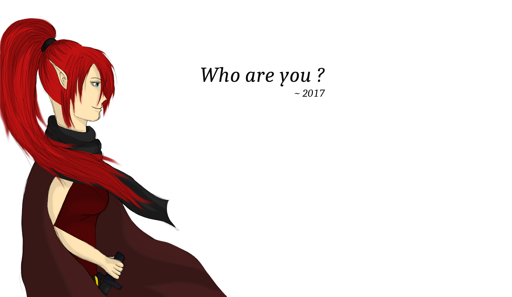
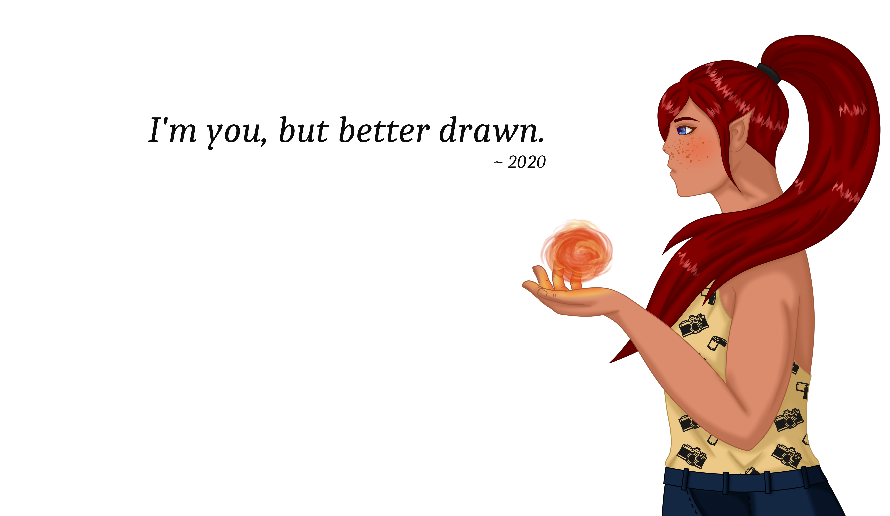
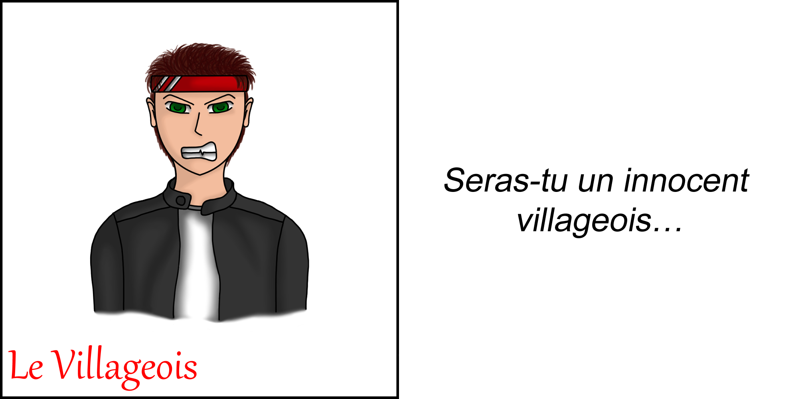
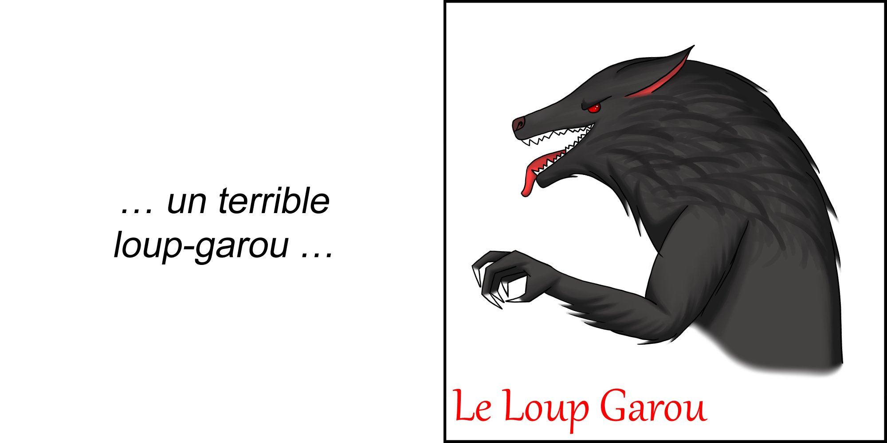
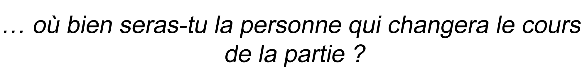
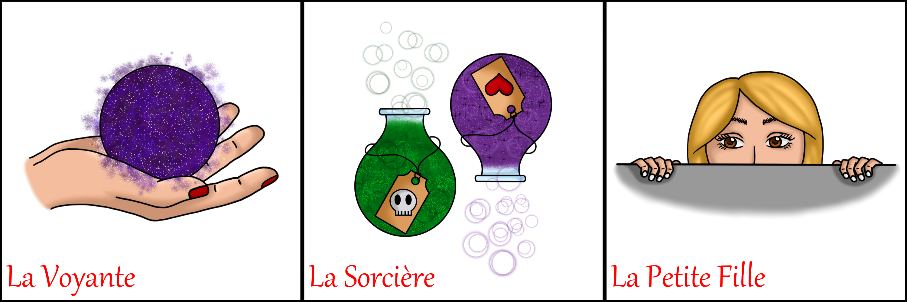
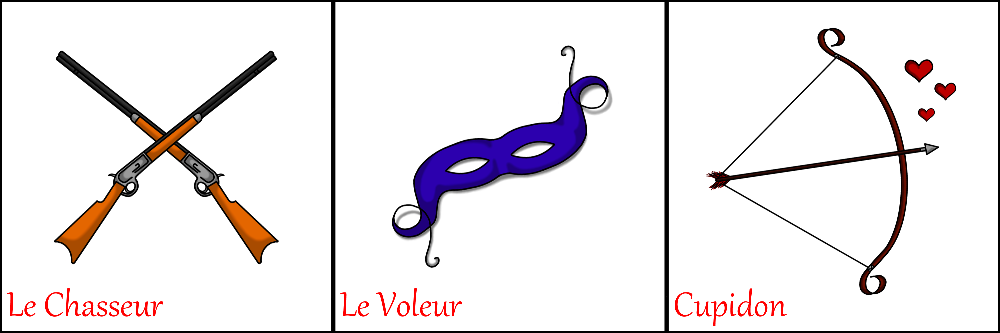

## A vos crayons !

### 1. Où tout a commencé...

Je dessine depuis que j'ai appris à tenir un crayon ce qui remonte à une bonne vingtaine d'année. Même si mes créations n'étaient pas du niveau des plus grands artistes, j'ai 
continué de m'exercer année après année, perfectionnant mes techniques et apprenant des nouvelles.
Les nouvelles technologies n'ayant pas encore envahi nos vies lorsque j'étais jeune, le crayon et la feuille ont été mes premiers outils avant d'être remplacés par un stylet et 
une tablette graphique.

Vous pouvez voir les images en grand format en cliquant sur les liens juste en dessous

[Passé](/images/graphique/past_v1.png) et [Futur](/images/graphique/future_v1.png)

### 2. Evolution

Avant d'avoir pu m'acheter une tablette graphique, j'ai scanné mes dessins puis je les ai mis en couleur avec Gimp...

 
[Portrait 1](/images/graphique/sirène_bleu.png) - [Portrait 2](/images/graphique/enora.png) - [Portrait 3](/images/graphique/personnage.png)
  
_Dessins réalisés en 2017_
  
... puis, lorsque l'occasion s'est présentée, je me suis achetée une tablette graphique Wacom Intuos et depuis j'utilise le logiciel Clip Studio Paint pour mettre en couleur 
mes dessins ...
  
Mon premier projet a été de redessiner le jeu du Loup-Garou afin de me familiariser avec mon nouvel environnement de travail

 
[Villageois](/images/graphique/loug_garou/villageois.png) - [Loup-Garou](/images/graphique/loug_garou/enora.png)
 
[Voyante](/images/graphique/loug_garou/voyante.png) - [Sorcière](/images/graphique/loug_garou/sorciere.png) - [Petite Fille](/images/graphique/loug_garou/petite_fille.png)
 
[Chasseur](/images/graphique/loug_garou/chasseur.png) - [Voleur](/images/graphique/loug_garou/voleur.png) - [Cupidon](/images/graphique/loug_garou/cupidon.png)
  
_Projet réalisé en 2019_

### 3. Progression

Durant le confinement, j'ai eu l'occasion de pouvoir m'exercer plus souvent sur ma tablette graphique !

#### 3.1. Portraits

 
[Portrait 1](/images/graphique/portrait_1.png) - [Portrait 2](/images/graphique/portrait_3_v2.png) - [Portrait 3](/images/graphique/portrait_4.png)
  
_Dessins réalisés en 2020_

#### 3.2. Personnages entiers et scènes

 
[Image 1](/images/graphique/personnage_1_bg_v3.png) - [Image 2](/images/graphique/wynn_et_eireen.png) - [Image 3](/images/graphique/scene_v4_bg_nature.png)
  
_Dessins réalisés en 2020_
